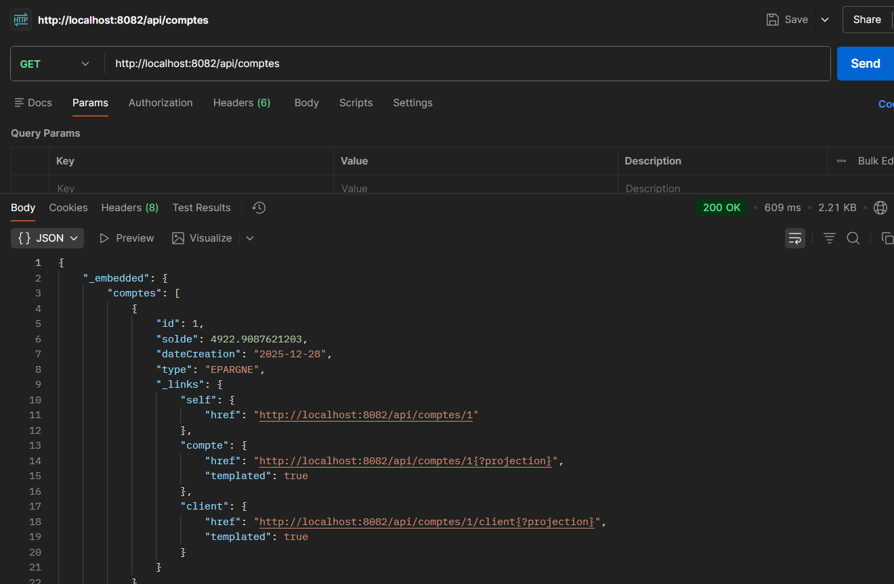
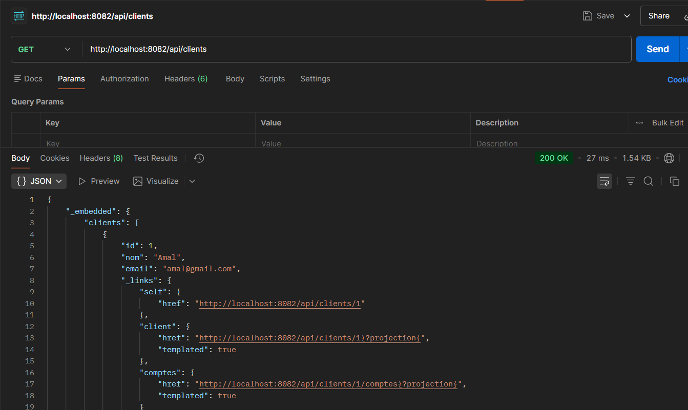
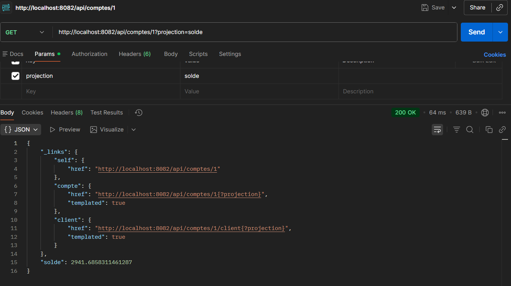
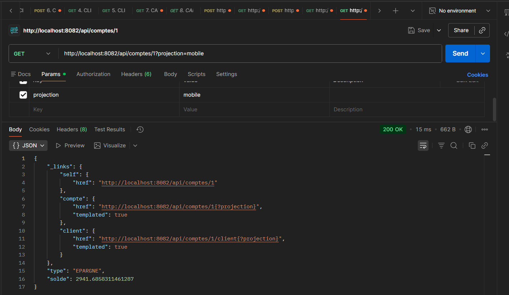
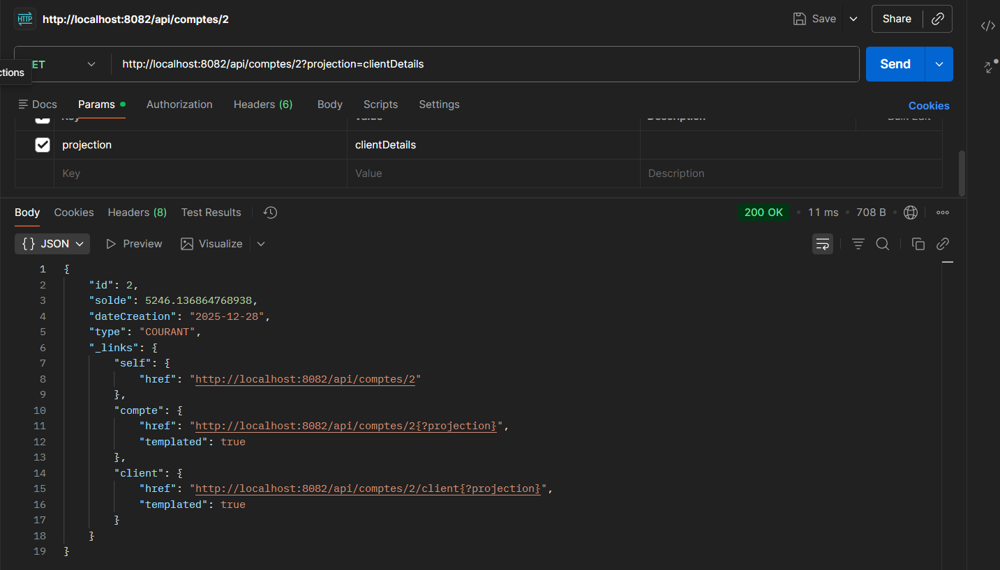

# 🏦 MsBanque - Spring Data REST API

Application bancaire développée avec **Spring Boot** et **Spring Data REST** pour gérer des comptes et clients via une API RESTful auto-générée.

## 📸 Screenshots

### API Endpoints




### Projections





## ✨ Fonctionnalités

- 🏦 **Gestion des Comptes** - CRUD complet via REST
- 👥 **Gestion des Clients** - Relations avec comptes
- 🔍 **Recherche par Type** - Filtrage COURANT/EPARGNE
- 📊 **Projections** - Vues personnalisées des données
- 💾 **H2 Console** - Base de données en mémoire

## 🛠️ Stack Technique

- **Spring Boot 3.5.7** + Java 17
- **Spring Data JPA** - Persistance
- **Spring Data REST** - API auto-générée
- **H2 Database** - Base en mémoire
- **Lombok** - Réduction boilerplate

## 🚀 Démarrage Rapide

```bash
# Lancer l'application
mvn spring-boot:run

# L'API sera disponible sur http://localhost:8082/api
```

## 🔗 Endpoints Principaux

| Endpoint                                   | Description            |
| ------------------------------------------ | ---------------------- |
| `GET /api/comptes`                         | Liste tous les comptes |
| `GET /api/comptes/{id}`                    | Détails d'un compte    |
| `GET /api/comptes/search/byType?t=EPARGNE` | Recherche par type     |
| `GET /api/clients`                         | Liste tous les clients |
| `GET /api/clients/{id}/comptes`            | Comptes d'un client    |

### Projections Disponibles

- `?projection=solde` - Solde uniquement
- `?projection=mobile` - Solde + Type
- `?projection=clientDetails` - Détails client

## 💾 Base de Données H2

- **Console**: http://localhost:8082/h2-console
- **JDBC URL**: `jdbc:h2:mem:banque`
- **Username**: `sa`
- **Password**: _(vide)_

## 📦 Données Initiales

L'application initialise automatiquement:

- 2 Clients: `Amal`, `Ali`
- 3 Comptes bancaires liés
